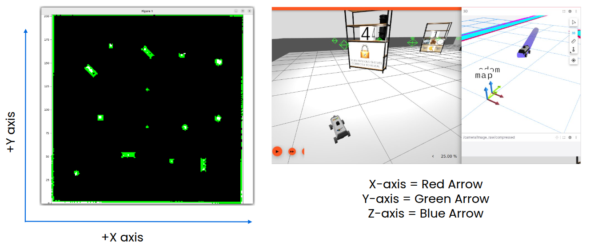
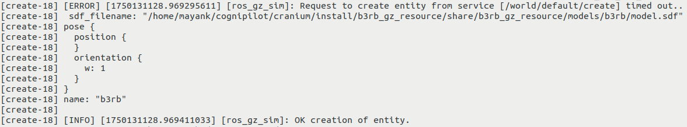
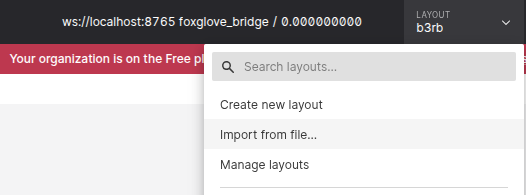
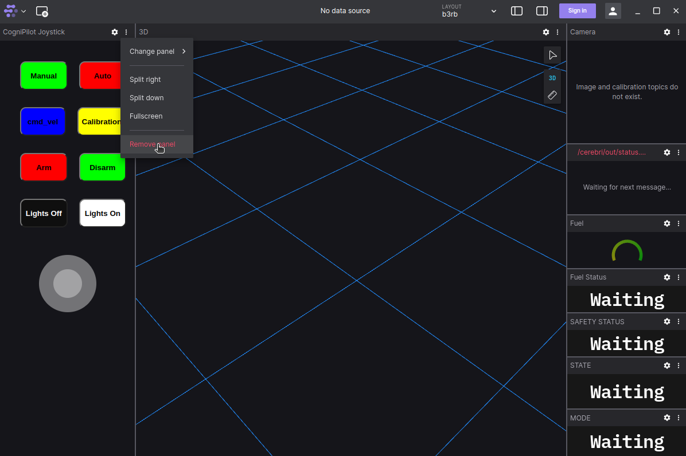

# WAREHOUSE TREASURE HUNT & OBJECT RECOGNITION

## <span style="background-color: #FFFF00">INTRODUCTION</span>
This project provides a ROS 2 framework for the **NXP B3RB Warehouse Challenge**.
- The `b3rb_ros_warehouse.py` script serves as a foundational ROS 2 node.
    * Participants will extend this script to implement the full challenge logic.
- Participants will perform the following tasks to score points:
    * Autonomous navigation
    * Locating the shelves using map or camera
    * Utilizing heuristic for faster completion
    * Identifying objects using YOLO-derived data
    * Decoding QR codes via the front camera
    * Strategically revealing hidden shelves

### <span style="background-color: #CBC3E3">HARDWARE</span>
This software is designed to run on the B3RB and can be tested in compatible Gazebo simulations.
1.  [NXP MR-B3RB](https://nxp.gitbook.io/mr-b3rb): The target hardware rover.
    * Requires a forward-facing camera for QR code detection and potentially shelf/object recognition.
    * Relies on sensors (LIDAR, encoders, IMU) for localization & mapping (SLAM), and navigation (Nav2).
2.  [Gazebo Simulator](https://gazebosim.org/home): For development and testing in a simulated warehouse environment.
    * The simulation provides a B3RB model with sensors and necessary packages such as SLAM & NAV2.

### <span style="background-color: #CBC3E3">SOFTWARE</span>
This project is based on the autopilot project - [CogniPilot](https://cognipilot.org/) (AIRY Release for B3RB).
<br>
Refer the [CogniPilot AIRY Dev Guide](https://airy.cognipilot.org/) for information about it's various components.
<br>
- **ROS 2:** Targeted for Humble Hawksbill.
- **Navigation:** Relies on a fully functional Nav2 stack.
    * Configuration for SLAM and Nav2 can be adjusted in `cranium/src/b3rb/b3rb_nav2/config`.
- **Object Recognition:** An external YOLO model is provided by default to publish the detected objects.
    * The objects are publish on `/shelf_objects` (`synapse_msgs/WarehouseShelf`) topic.
- **Python Libraries:**
    * `rclpy`: ROS 2 client library for Python.
    * `numpy`: For numerical operations, particularly with map data.
    * `opencv`: For image processing, crucial for QR code decoding.
    * `scipy`: For image analysis and spatial distance calculations.
    * `tkinter`: For the optional progress table GUI.
- **[Cranium](https://airy.cognipilot.org/cranium/about/)**: A ROS workspace that performs higher level computation for CogniPilot.
    * On the hardware B3RB, it runs on [NavQPlus](https://nxp.gitbook.io/navqplus/) IMX8MPLUS (Mission Computer).
    * On the Gazebo Simulator, it runs on the Ubuntu Linux machine.
    * Relevant packages (detailed later):
        1. **b3rb_ros_aim_india**
        2. **synapse_msgs**
        3. **dream_world**
        4. **b3rb**
    * Interaction with the `cerebri` via `/cerebri/out/status` and `/cerebri/in/joy` topics.
- This project includes a ROS2 Python package (b3rb_ros_aim_india) that integrates into Cranium.

---
## <span style="background-color: #FFFF00">WAREHOUSE CHALLENGE DESCRIPTION</span>

The primary goal is to maximize points by correctly identifying objects and decoding QR codes.

### <span style="background-color: #CBC3E3; font-weight:bold">SIMULATION WORLD</span>
- **Warehouse:** Contains N distinct shelves with various obstacles that the participants must avoid.
    * Navigation is completely automated; alternatively participants may utilize manual mode at their discretion.
- **QR Codes:** A QR code is placed on both sides of the shelves. It's a 30 character string that contains the following:
    1. **Shelf ID:** A natural number from 1 to n.
    2. **Heuristic:** The **angle (0-360°)** from the x-axis to the line from current to next shelf.
        * The x-axis and y-axis are given by the red and green arrow in the foxglove map respectively.
        * The angle is embedded as a 5-character string starting from the 2nd index, as a float value.
        * First heuristic (angle from x-axis to the line from robot to first shelf) will be given beforehand.
        * NOTE: Angles are measured using the center of mass of shelves and the robot in the 2-D space.
    3. **Random string**: 20 character secret code unique for each shelf used for evaluation.
    * Format: For example QR string `2_116.6_HKq3wvCg8DGyflz3oNIj8d`, shelf ID = `2` and angle = `116.6`.
- **Shelves & Curtains:** Each shelf has two rows, with 3 objects per row (6 total), visible from both front and back.
    * **All shelves, except the first one in the sequence, are completely covered by a curtain.**
    * A shelf's curtain is unveiled only when the QR of **all previous shelves** are published to `/shelf_data`.
        * For example, the curtain of shelf 3 is unveiled when QR of shelf 1 and 2 are published correctly.
    * Hence, it's most efficient to utilize the heuristic and traverse the shelves in the sequence order.

### <span style="background-color: #CBC3E3; font-weight:bold">TASK WORKFLOW (PARTICIPANT IMPLEMENTATION)</span>
Participants are responsible for implementing the logic for the following treasure hunt sequence:

1.  **Locate First Shelf:**
    * **Task:** Identify the center of mass and orientation of the first shelf.
        * By recognizing the footprint on the SLAM-generated map (`/map`, `/global_costmap`).
        * Alternatively, image processing on the feed from the buggy's front camera can be used.
        * The choice of method is at the participants' discretion.
    * ⚠️ NOTE: Exploration to unknown spaces may be required before a sufficient map is created.
2.  **Navigate to Target Shelf:**
    * **Task:** Utilize the Nav2 action client (detailed later) to move the B3RB to the shelf's vicinity.
3.  **Navigate to and Decode QR Code:**
    * **Task:** Maneuver the robot to the side of the shelf to view the QR code on the current shelf.
    * **Action:** Capture an image and implement QR decoding to extract its string.
4.  **Align for Object Recognition:**
    * **Task:** Position the buggy so its front camera captures a clear image of the objects in the shelf.
        * This facilitates accurate YOLO model recognition.
    * **Action:** Subscribe to `/shelf_objects` to receive the recognized objects from the YOLO model.
5.  **Publish Shelf Data:**
    * **Task:** Create and populate a `synapse_msgs/WarehouseShelf` message with:
        * Identified objects and count.
        * The decoded QR code string.
    * **Action:** Publish this message to `/shelf_data`.
6.  **Curtain Reveal Mechanism:**
    * **Rule:** Correctly publishing the QR for all preceding shelves in the sequence unveils the **next shelf**.
    * **Example:** Publishing the QR of shelf 1 and 2 will reveal the curtain of the 3rd shelf.
7.  **Find and Navigate to Next Shelf:**
    * **Task:** Use the decoded heuristic (angle) to determine the location of the next "treasure" spot (shelf).
        * Alternatively, participants may explore randomly to discover the remaining shelves.
    * **Action:** Explore and locate the newly revealed shelf and repeat the process from step 3.

### <span style="background-color: #CBC3E3; font-weight:bold">EVALUATION AND SCORING</span>
- **Evaluation:** Participants will publish `WarehouseShelf` messages on `/shelf_data` for evaluation.
    * `synapse_msgs/msg/WarehouseShelf.msg` is a custom message type for sending QR and objects.
        * Its usage is demonstrated in `shelf_objects_callback` in b3rb_ros_warehouse_explore.py.
    * Participants may publish  multiple times but only the last message per shelf will be used for scoring.
    * ⚠️ **ALERT: Only one message shall be sent for the last shelf, as it marks task end.**
- **Scoring:**
    * 0.5 points are awarded for every correctly identified object.
    * 1.0 point is deducted for every wrongly identified object.
    * 1.0 point is awarded for correctly publishing all objects of a particular shelf.
    * 15.0 points are awarded percentile wise based on the number of objects correctly published.
        * This is only awarded to participants that correctly publish at least 80% of total objects.
    * 15.0 points are awarded percentile wise based on time taken to complete the task.
        * This is only awarded to participants that correctly publish at least 80% of total objects.
    * 1.0 point is deducted for every collision with any obstacle.
    * 1.0 point is awarded for every QR published correctly.
    * 2.0 points are awarded for every training session attended; recorded using attendance form.

---
## <span style="background-color: #FFFF00">`b3rb_ros_warehouse.py` SCRIPT FUNCTIONALITY OVERVIEW</span>

The `explore` node provides a foundational structure.

### <span style="background-color: #FFC0CB; font-weight:bold">SLAM MAP (INTRODUCTION & UNDERSTANDING)</span>
- The maps are created using LIDAR, IMU and odometry data.
- **Coordinate Frames:**
    1. **Occupancy Grid Frame:** SLAM maps are shared as [nav_msgs/OccupancyGrid](https://docs.ros.org/en/noetic/api/nav_msgs/html/msg/OccupancyGrid.html) which is a 2-D grid.
        * Each cell represents the probability (expressed as 0-100) of being occupied by an object.
        * Thus, 0 = free space, 100 = occupied by obstacle; -1 (special case) = unexplored space.
        * For conversion to world coordinate frame:
            * Origin: Position of the bottom-left corner of the map in the world frame in meters.
            * Resolution: Length of each grid cell in meters.
        * (0, 0) is the bottom-most and left-most cell in the map in the below diagrams.
    2. **World Coordinate Frame:** Real world coordinates in meters.
        * Origin: The starting point of the robot.
- **Types of Occupancy Grid Frames:**
    1. Static costmap (`/map`): Simple map used for quick decisions​
    2. Global costmap (`/global_costmap/costmap`): Static costmap + inflation
        * Inflation: The expanding of obstacles in the costmap to create a buffer zone around them.
        * It's used because the robot needs to account for its size and potential localization errors.
    * Axes: The axes for static and global maps are given as follows. (NOTE: x-axis is robot's front direction at starting.) <br>
    

### <span style="background-color: #FFC0CB; font-weight:bold">NAVIGATION FRAMEWORK (BASE FUNCTIONALITY)</span>
- **Core Navigation Logic:** The script offers a framework for navigation using a Nav2 action client.
    * Participants provide a goal pose, and the Nav2 stack manages robot movement.
    * **Goal:** Consists of x-y coordinates (in world coordinate frame) and yaw (angle about the z-axis).
        * NOTE: YAW is the angle (between 0 to 2π) from the Positive x-axis in CCW direction.
    * The Nav2 stack provides feedback on the current goal's status via a feedback callback.
    * A mechanism to cancel an ongoing navigation goal is included.
        * This can be used if a goal repeatedly fails or if a more optimal goal is found.
- **Autonomous Exploration Example (Frontier-Based):**
    * The script includes a demo frontier-based exploration approach for space exploration.
        * This demonstrates Nav2 usage and how the warehouse might be initially explored.
        * Participants have **full autonomy** to modify or replace this exploration logic.
    * **Frontier Detection (`get_frontiers_for_space_exploration`):**
        * Identify the boundaries between explored and unknown space.
        * Select the next exploration goal intelligently, considering proximity to obstacles.
- **Robot Arming:** Monitors `/cerebri/out/status` and attempts to arm via `/cerebri/in/joy`.

### <span style="background-color: #FFC0CB; font-weight:bold">WAREHOUSE INTERACTION (FRAMEWORK FOR CHALLENGE)</span>
- **Shelf Object Handling:**
    * Subscribes to `/shelf_objects` (`synapse_msgs/WarehouseShelf`): `self.shelf_objects_callback`.
        * **Participants must process `self.shelf_objects_curr` for task-specific object identification.**
    * Publishes to `/shelf_data` (`synapse_msgs/WarehouseShelf`): `self.publisher_shelf_data`.
        * **Participants must construct and send messages per challenge rules.**
- **QR Code Detection (Framework):**
    * Subscribes to `/camera/image_raw/compressed`: `self.camera_image_callback`.
        * **Participants must implement QR decoding logic here.**
    * Participants may store the the last decoded QR string in `self.qr_code_str`.
    * Optionally publish debug images for QR to `/debug_images/qr_code`.

### <span style="background-color: #FFC0CB; font-weight:bold">GUI - PROGRESS TABLE (OPTIONAL UTILITY)</span>
- **`WindowProgressTable` Class:** A Tkinter-based GUI.
- **Functionality:**
    * Displays a 2 x n grid, mapping to 2 rows and n shelves.
    * Can be enabled/disabled using the `PROGRESS_TABLE_GUI` flag.
    * This GUI is provided for participant convenience to track progress. It's use is entirely **optional**.
    * **Participants choosing to use it should integrate updates to reflect their challenge progress.**
- It's usage is described in `shelf_objects_callback`.

### <span style="background-color: #FFC0CB; font-weight:bold">KEY SUBSCRIBED TOPICS (RELEVANT TO CHALLENGE)</span>
- `/pose` ([geometry_msgs/PoseWithCovarianceStamped](https://docs.ros.org/en/noetic/api/geometry_msgs/html/msg/PoseWithCovarianceStamped.html)): Current robot pose.
- `/global_costmap/costmap` ([nav_msgs/OccupancyGrid](https://docs.ros.org/en/noetic/api/nav_msgs/html/msg/OccupancyGrid.html)): Global costmap from Nav2.
- `/map` ([nav_msgs/OccupancyGrid](https://docs.ros.org/en/noetic/api/nav_msgs/html/msg/OccupancyGrid.html)): Raw map from SLAM.
- `/cerebri/out/status` (`synapse_msgs/Status`): Robot's low-level controller status.
- `/shelf_objects` (`synapse_msgs/WarehouseShelf`): **YOLO model output.**
- `/camera/image_raw/compressed` ([sensor_msgs/CompressedImage](https://docs.ros.org/en/melodic/api/sensor_msgs/html/msg/CompressedImage.html)): **Image stream.**

### <span style="background-color: #FFC0CB; font-weight:bold">KEY PUBLISHED TOPICS (RELEVANT TO CHALLENGE)</span>
- `/cerebri/in/joy` ([sensor_msgs/Joy](https://docs.ros.org/en/noetic/api/sensor_msgs/html/msg/Joy.html)): For changing mode and arming the buggy.
- `/shelf_data` (`synapse_msgs/WarehouseShelf`): **Publish identified objects and QR data.**
- `/debug_images/qr_code` ([sensor_msgs/CompressedImage](https://docs.ros.org/en/melodic/api/sensor_msgs/html/msg/CompressedImage.html)): Optional for debugging QR processing.

### <span style="background-color: #FFC0CB; font-weight:bold">ACTION CLIENTS</span>
- **`MapsToPose` Action Client:** Used for sending navigation goals to Nav2 ([nav2_msgs/NavigateToPose](https://github.com/ros-planning/navigation2/blob/humble/nav2_msgs/action/NavigateToPose.action)).

---
## <span style="background-color: #FFFF00">`b3rb_ros_object_recog.py` SCRIPT FUNCTIONALITY OVERVIEW</span>

The `detect` node provides the framework for running the default quantized YOLOv5 object recog model. <br>
Participants may modify this or implement a different method for object recognition, for improving accuracy.

### <span style="background-color: #FFC0CB; font-weight:bold">KEY SUBSCRIBED TOPICS (Relevant to Challenge)</span>
- `/camera/image_raw/compressed` ([sensor_msgs/CompressedImage](https://docs.ros.org/en/melodic/api/sensor_msgs/html/msg/CompressedImage.html)): **Image stream.**

### <span style="background-color: #FFC0CB; font-weight:bold">KEY PUBLISHED TOPICS (Relevant to Challenge)</span>
- `/shelf_objects` (`synapse_msgs/WarehouseShelf`): **Publish identified objects.**
- `/debug_images/object_recog` ([sensor_msgs/CompressedImage](https://docs.ros.org/en/melodic/api/sensor_msgs/html/msg/CompressedImage.html)): Publish debug image.

---
## <span style="background-color: #FFFF00">`b3rb_ros_model_remove.py` SCRIPT FUNCTIONALITY OVERVIEW</span>

The `remover` node provides a script for removing curtains from shelves per challenge rules. <br>
Participants are not required to modify this script. This script will be used for evaluation as is.

---
## <span style="background-color: #FFFF00">`b3rb_ros_draw_map.py` SCRIPT FUNCTIONALITY OVERVIEW</span>

The `visualize` node helps visualizing the simple map created by  SLAM on a matplotlib window. <br>
Participants may utilize this to debug their solution. This script will not be run during evaluation.

---
## <span style="background-color: #FFFF00">EXECUTION STEPS</span>

**Requirements:**
1. [Ubuntu 22.04.5](https://releases.ubuntu.com/jammy/) (Fresh installation recommended to prevent any compatibility conflict with current setup)
2. Unrestricted internet (Official network such as college wifi is not recommended; use personal internet)

**General Guidelines**
1. Press `Y` and `enter` wherever necessary.
2. Enter **sudo password** wherever necessary.

Run the commands in code boxes (like the following) in the terminal window.
```
sudo apt install git
```

In case the installation or setup gets corrupted, run the following to clean the entire system: <br>
**(⚠️ ALERT: This is a nuclear option, will delete the whole setup and should be used carefully.)**
```
sudo apt-get remove gz-garden
sudo apt-get remove ros-humble-ros-gzgarden
sudo apt-get remove gz-harmonic
sudo apt-get remove ros-humble-ros-gzharmonic

sudo rm -rf /opt/toolchains
sudo rm -rf /opt/zeth
sudo rm -rf /opt/poetry
rm -rf ~/bin/build_*
rm -rf ~/bin/west
rm -rf ~/bin/cyecca
rm -rf ~/bin/docs
rm -rf ~/cognipilot
```

### <span style="background-color: #CBC3E3; font-weight:bold">PART 1</span>

**Install CogniPilot by executing the following steps (taken from [https://airy.cognipilot.org/getting_started/install/](https://airy.cognipilot.org/getting_started/install/)):**
1. NOTE:
    1. docker method is **not** recommended
    2. SSH and GPG keys are **not** required
2. Use CogniPilot universal installer: Open a terminal and run the following.
    ```
    sudo apt-get update
    sudo apt-get install git wget -y
    mkdir -p ~/cognipilot/installer
    wget -O ~/cognipilot/installer/install_cognipilot.sh https://raw.githubusercontent.com/CogniPilot/helmet/main/install/install_cognipilot.sh
    chmod a+x ~/cognipilot/installer/install_cognipilot.sh
    /bin/bash ~/cognipilot/installer/install_cognipilot.sh
    ```
    1. Select `1` (airy) when asked for 'release'
    2. Select `1` (native) when asked for 'installer type'
    3. If you are asked "Do you want to continue" then select `Y` and press enter
    4. Select `n` (No) when asked for 'ssh keys'
3. Build the workspace: Open a terminal and run the following.
    ```
    source ~/.profile
    source ~/.bashrc
    build_workspace
    ```
    1. select `n` (No) "for use ssh keys"
    2. select `1` (b3rb) "for platform"
4. Source ~/.bashrc.
    ```
    source ~/.bashrc
    ```
5. Build Foxglove.
    ```
    build_foxglove
    ```
    1. select `n` (No) when asked for 'ssh keys'
    2. select `1` (airy) when asked for 'release'

### <span style="background-color: #CBC3E3; font-weight:bold">PART 2</span>

Open a terminal in a temp location and follow the following steps to setup **[NXP_AIM_INDIA_2025](https://github.com/NXPHoverGames/NXP_AIM_INDIA_2025)** and **YOLOv5**.
```
git clone https://github.com/NXPHoverGames/NXP_AIM_INDIA_2025 NXP_AIM_INDIA_2025
mv NXP_AIM_INDIA_2025 ~/cognipilot/cranium/src/

git clone https://github.com/NXPHoverGames/B3RB_YOLO_OBJECT_RECOG.git
cd B3RB_YOLO_OBJECT_RECOG
git checkout nxp_aim_india_2025

mv resource/coco.yaml ~/cognipilot/cranium/src/NXP_AIM_INDIA_2025/resource/
mv resource/yolov5n-int8.tflite ~/cognipilot/cranium/src/NXP_AIM_INDIA_2025/resource/
mv b3rb_ros_aim_india/b3rb_ros_object_recog.py ~/cognipilot/cranium/src/NXP_AIM_INDIA_2025/b3rb_ros_aim_india/

cd ..
rm -rf B3RB_YOLO_OBJECT_RECOG
```

 <span style="background-color:rgb(255, 238, 0); font-weight:bold">Then in "~/cognipilot/cranium/src/NXP_AIM_INDIA_2025/setup.py" uncomment lines 12, 13 and 28.</span>

Perform the following steps to setup the environment and build cranium for NXP_AIM_INDIA_2025:

1.  **Setup Environment:**
    ```bash
    cd ~/cognipilot/cranium/src/
    rm -rf dream_world
    rm -rf synapse_msgs
    rm -rf b3rb_simulator

    cd ~/cognipilot/cranium/src/
    git clone https://github.com/NXPHoverGames/dream_world.git
    cd ~/cognipilot/cranium/src/dream_world
    git checkout nxp_aim_india_2025

    cd ~/cognipilot/cranium/src/
    git clone https://github.com/NXPHoverGames/synapse_msgs.git
    cd ~/cognipilot/cranium/src/synapse_msgs
    git checkout nxp_aim_india_2025

    cd ~/cognipilot/cranium/src/
    git clone https://github.com/NXPHoverGames/b3rb_simulator.git
    cd ~/cognipilot/cranium/src/b3rb_simulator
    git checkout nxp_aim_india_2025
    ```

2.  **Install Dependencies:** (The following modules are allowed for use in your solution.)
    - **ALERT: If you wish to use an additional python module, refer "SUBMISSION RULES" below**
    ```bash
    pip install \
        torch==2.3.0 \
        torchvision==0.18.0 \
        numpy==1.26.4 \
        opencv-python==4.11.0.86 \
        scipy==1.15.1 \
        scikit-learn==1.5.2 \
        tk==0.1.0 \
        pyzbar==0.1.9 \
        matplotlib==3.5.1 \
        pyyaml==6.0.2 \
        tflite-runtime==2.14.0
    ```

### <span style="background-color: #CBC3E3; font-weight:bold">PART 3</span>

There are four simulation world environments which you can load for your testing.
* nxp_aim_india_2025/warehouse_1
* nxp_aim_india_2025/warehouse_2
* nxp_aim_india_2025/warehouse_3
* nxp_aim_india_2025/warehouse_4

The following world specific parameters are passed from the command line while running "ros2 launch":
* `warehouse_id`
* `initial_angle`
* `shelf_count`

Perform the following steps:

3.  **Build Workspace and Launch Gazebo Simulation:**

    NOTE: Whenever you make a change, `colcon build` and `source setup.bash` is required as follows. <br>
    ⚠️ NOTE: Execute only one of the "ros2 launch" commands, depending upon which world you wish to load.

    ```bash
    cd ~/cognipilot/cranium/
    colcon build
    source ~/cognipilot/cranium/install/setup.bash

    # execute one of the following depending on which world you wish to load.
    ros2 launch b3rb_gz_bringup sil.launch.py world:=nxp_aim_india_2025/warehouse_1 warehouse_id:=1 shelf_count:=2 initial_angle:=135.0 x:=0.0 y:=0.0 yaw:=0.0
    ros2 launch b3rb_gz_bringup sil.launch.py world:=nxp_aim_india_2025/warehouse_2 warehouse_id:=2 shelf_count:=4 initial_angle:=040.6 x:=0.0 y:=-7.0 yaw:=1.57
    ros2 launch b3rb_gz_bringup sil.launch.py world:=nxp_aim_india_2025/warehouse_3 warehouse_id:=3 shelf_count:=3 initial_angle:=045.0 x:=5.0 y:=-2.0 yaw:=3.14
    ros2 launch b3rb_gz_bringup sil.launch.py world:=nxp_aim_india_2025/warehouse_4 warehouse_id:=4 shelf_count:=5 initial_angle:=045.0 x:=5.0 y:=-2.0 yaw:=3.14
    ```

    <span style="background-color:rgb(255, 238, 0); font-weight:bold">This will open two new windows - "cerebri terminal" (never use this shell) and "Gazebo Sim".</span>

    ⚠️ NOTE: If you get a simulation launch create error (like the following), then cancel the above command & run `ros2 launch` again.
    


### <span style="background-color: #CBC3E3; font-weight:bold">PART 4</span>

(OPTIONAL: For visualizing slam map.)

4.  **Open a new terminal and follow the following steps for running b3rb_ros_draw_map:**
    ```bash
    source ~/cognipilot/cranium/install/setup.bash
    ros2 run b3rb_ros_aim_india visualize
    ```

(OPTIONAL: For debugging with Foxglove.)

5. Clone and checkout `electrode` from NXPHoverGames using the following steps:
    ```
    cd ~/cognipilot/electrode/src/
    rm -rf electrode
    git clone https://github.com/NXPHoverGames/electrode.git
    cd electrode
    git checkout nxp_aim_india_2025
    ```
    This commit appends the following in the **default_value** of **topic_whitelist** in **[electrode.launch.py](https://github.com/CogniPilot/electrode/blob/airy/launch/electrode.launch.py)**:
    1. "/debug_images/object_recog"
    2. "/debug_images/qr_code"

6. **Open a new terminal and follow the following steps for building and running Foxglove.**
    ```bash
    cd ~/cognipilot/electrode/
    colcon build
    source ~/cognipilot/electrode/install/setup.bash
    ros2 launch electrode electrode.launch.py sim:=True
    ```

    - Sign in with your personal account (you may need to create an account on Foxglove); <br>
    - Then connect to simulation by clicking on "Open connection", then set WebSocket URL as "ws://localhost:8765". <br>
    - Click on 'layout', click on 'import from file', select "~/cognipilot/electrode/src/electrode/foxglove_layouts/b3rb.json". <br>
    

    ⚠️ NOTE: If `/cerebri/out/status` are in **Waiting** state (like in the following), then cancel all commands and restart from step 3.
    

## <span style="background-color: #FFFF00">ADVANCED STEPS FOR FASTER DEVELOPMENT (OPTIONAL)</span>

You may create a bash file (unique for each world) for faster execution. For example for warehouse_1:
```
cd ~/cognipilot/cranium/
colcon build
source install/setup.bash
ros2 launch b3rb_gz_bringup sil.launch.py world:=nxp_aim_india_2025/warehouse_1 warehouse_id:=1 shelf_count:=2 initial_angle:=135.0 x:= 0.0 y:=0.0 yaw:0.0
```

## <span style="background-color: #FFFF00">`cranium/src/b3rb/b3rb_nav2` PACKAGE FUNCTIONALITY OVERVIEW</span>
Participants are allowed to modify the following files in the NAV2 package in CRANIUM to enhance navigation. <br>
Participants are encouraged to tune the configuration parameters based on their algorithm & performance needs. <br>

1. **~/cognipilot/cranium/src/b3rb/b3rb_nav2/config/nav_to_pose_bt.xml**
    - It defines the behavior tree for navigating to a single goal pose.
2. **~/cognipilot/cranium/src/b3rb/b3rb_nav2/config/nav_through_poses_bt.xml**
    - It defines the behavior tree for navigating through multiple waypoints.
3. **~/cognipilot/cranium/src/b3rb/b3rb_nav2/config/nav2.yaml**
    - Central configuration for the Nav2 (ROS2 navigation) stack.
    - Key parameters: obstacle inflation, goal tolerances, recovery behaviors, global and local parameters.
4. **~/cognipilot/cranium/src/b3rb/b3rb_nav2/config/slam.yaml**
    - It defines the configuration parameters for slam_toolbox (Simultaneous Localization and Mapping).
    - Key parameters: map resolution, update intervals, scan throttling, loop closure settings.

⚠️ NOTE: Modifying parameters involves tradeoff between the following:
- Mapping accuracy
- CPU usage
- Responsiveness
- Robustness.
- Stability

## <span style="background-color: #FFFF00">PARTICIPANT IMPLEMENTATION FOCUS</span>
Participants should modify and extend `b3rb_ros_warehouse.py` and `b3rb_ros_object_recog.py` to:
-   **Shelf Detection:** Implement robust logic for finding shelf locations (map-based or vision-based).
    - map based: `global_map_callback` or `simple_map_callback`
    - image based (taken from front of the robot): `camera_image_callback`
-   **Targeted Navigation:** Develop functions for precise navigation to:
    * The front/back of shelves for object viewing.
    * QR code locations on either side of shelves.
-   **Navigation Recovery:** The Nav2 action client may collide the robot with obstacles if not tuned correctly.
    * ⚠️ **Participants are strongly advised to implement a recovery logic** by cancelling current goal.
    * Then, move robot away from the obstacle using manual mode after analyzing the map.
-   **State Management:** Track the status of n shelves (IDs, objects, QR codes, curtain revealed or not).
-   **Object Data Processing:** In `shelf_objects_callback`, associate identified objects with shelves.
-   **QR Code Decoding:** Implement reliable QR code detection/decoding in `camera_image_callback`.
-   **Challenge Strategy:** Design the overall approach:
    * Explore world using heuristic.
    * Visiting shelves in sequence.
    * Error handling and recovery.
-   **Data Publication Logic:** Create message and publish to `/shelf_data` per scoring rules.
-   **GUI Integration (Optional):** If using `WindowProgressTable`, update it to reflect challenge state.
-   NOTE: As a fallback, participants may discard the heuristic and explore randomly to locate shelves.
    * Then, visit all shelves in order and perform the necessary tasks.

## <span style="background-color: #FFFF00">AREAS FOR DEVELOPMENT IN THE WAREHOUSE SCRIPT</span>
- **Shelf Detection:** The base script lacks specific shelf detection logic; this is a key participant task.
- **Navigating to Shelves**: Position the robot such that shelf objects are clearly visible by front camera.
- **QR Code Decoding:** `camera_image_callback` is a placeholder requiring implementation.
- **Comprehensive State Machine:** A robust state machine for challenge workflow management.
- **Object Recognition:** Improve the default object recognition module provided, if needed.
    * Areas of improvement for object recognition: Accuracy, inference time, output classes.

## <span style="background-color: #FFFF00">SUBMISSION RULES</span>
⚠️ **NOTE: NXP laptop will be used for evaluation. No additional package installation will be allowed.** <br>
**The code should work with the default setup created at the time of installing CogniPilot Airy release.** <br> <br>
**NOTE: Additional python modules may be permitted only after written consent from the AIM TEAM.**
- Contact NXP AIM Technical Team if you wish to use a python module not in the following list:
    - torch==2.3.0, torchvision==0.18.0, numpy==1.26.4, opencv-python==4.11.0.86, scipy==1.15.1,
    - scikit-learn==1.5.2, tk==0.1.0, pyzbar==0.1.9, matplotlib==3.5.1, pyyaml==6.0.2, tflite-runtime==2.14.0.

**Participants will submit the following for the final evaluation:**
1. b3rb_ros_aim_india
    - NOTE: Unset PROGRESS_TABLE_GUI at b3rb_ros_warehouse.py:56
2. b3rb: The following files only.
    - ~/cognipilot/cranium/src/b3rb/b3rb_nav2/config/nav_to_pose_bt.xml
    - ~/cognipilot/cranium/src/b3rb/b3rb_nav2/config/nav_through_poses_bt.xml
    - ~/cognipilot/cranium/src/b3rb/b3rb_nav2/config/nav2.yaml
    - ~/cognipilot/cranium/src/b3rb/b3rb_nav2/config/slam.yaml
# aim_0170
